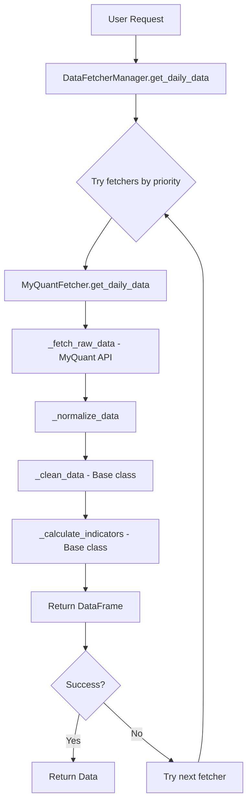
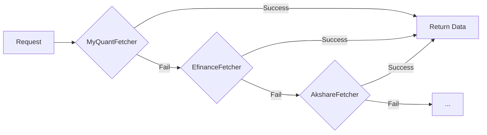

# MyQuant Data Provider Integration Design

## Executive Summary

This document outlines the technical design for integrating MyQuant (掘金量化) as a new data source in the `daily_stock_analysis` project. MyQuant provides professional-grade quantitative data services for Chinese A-shares market.

---

## 1. Base Class Interface Summary

### 1.1 Core Abstract Methods (Must Implement)

The [`BaseFetcher`](data_provider/base.py:109) abstract base class requires two methods:

| Method | Signature | Description |
|--------|-----------|-------------|
| `_fetch_raw_data` | `(stock_code: str, start_date: str, end_date: str) -> pd.DataFrame` | Fetch raw historical data from the data source |
| `_normalize_data` | `(df: pd.DataFrame, stock_code: str) -> pd.DataFrame` | Transform raw data to standard format |

### 1.2 Standard Output Columns

The [`STANDARD_COLUMNS`](data_provider/base.py:38) constant defines required columns:
```python
['date', 'open', 'high', 'low', 'close', 'volume', 'amount', 'pct_chg']
```

After processing, additional columns are added by [`_calculate_indicators()`](data_provider/base.py:287):
- `ma5`, `ma10`, `ma20` - Moving averages
- `volume_ratio` - Volume ratio indicator

### 1.3 Optional Methods to Implement

| Method | Returns | Purpose |
|--------|---------|---------|
| `get_realtime_quote()` | `Optional[UnifiedRealtimeQuote]` | Real-time stock quotes |
| `get_stock_name()` | `Optional[str]` | Get Chinese stock name |
| `get_stock_list()` | `Optional[pd.DataFrame]` | Get all stock list |
| `get_main_indices()` | `Optional[List[Dict]]` | Market index data |
| `get_market_stats()` | `Optional[Dict]` | Market statistics |
| `get_sector_rankings()` | `Optional[Tuple[List, List]]` | Sector rankings |
| `get_chip_distribution()` | `Optional[ChipDistribution]` | Chip distribution data |

### 1.4 Class Attributes

```python
name: str = "MyQuantFetcher"  # Unique identifier
priority: int = 2             # Lower = higher priority (0-99)
```

### 1.5 Data Flow Diagram



---

## 2. MyQuant SDK Analysis

### 2.1 SDK Installation

Based on MyQuant official documentation:

```bash
pip install gm
```

### 2.2 Authentication Method

MyQuant uses token-based authentication:

```python
from gm.api import set_token, get_fundamentals, get_history_instruments

# Set authentication token
set_token("your_token_here")
```

**Note:** The actual authentication method should be verified from the official documentation at:
https://www.myquant.cn/docs2/sdk/python/快速开始.html#提取数据研究示例

### 2.3 Key API Methods (To Be Verified)

Based on typical quantitative data platforms, the following methods are likely available:

| Category | Method | Purpose |
|----------|--------|---------|
| Historical | `get_history_instruments` | Historical daily data |
| Real-time | `get_realtime_quotes` | Real-time quotes |
| Instruments | `get_instruments` | Stock list and info |
| Fundamentals | `get_fundamentals` | Fundamental data |
| Index | `get_index_constituents` | Index constituents |

### 2.4 Data Format (Typical)

MyQuant typically returns data with these fields:
- `symbol` - Stock symbol (e.g., "SHSE.600519")
- `eob` / `bob` - End/Begin of bar timestamp
- `open`, `high`, `low`, `close` - OHLC prices
- `volume` - Trading volume
- `amount` - Trading amount

---

## 3. Implementation Design

### 3.1 File Structure

```
data_provider/
├── __init__.py          # Add MyQuantFetcher import and export
├── base.py              # No changes needed
├── myquant_fetcher.py   # NEW: MyQuant implementation
└── ...
```

### 3.2 Class Design

```python
# data_provider/myquant_fetcher.py

import logging
import os
from datetime import datetime
from typing import Optional, List, Dict, Any, Tuple

import pandas as pd
from tenacity import retry, stop_after_attempt, wait_exponential

from .base import BaseFetcher, DataFetchError, RateLimitError, STANDARD_COLUMNS
from .realtime_types import UnifiedRealtimeQuote, RealtimeSource, safe_float, safe_int
from src.config import get_config

logger = logging.getLogger(__name__)


class MyQuantFetcher(BaseFetcher):
    """
    MyQuant (掘金量化) Data Provider Implementation
    
    Data Source: https://www.myquant.cn
    SDK Documentation: https://www.myquant.cn/docs2/sdk/python/
    
    Features:
    - Professional-grade quantitative data
    - Requires token authentication
    - Supports A-shares, ETFs, indices
    
    Priority: Dynamic (0 if token configured, 99 otherwise)
    """
    
    name = "MyQuantFetcher"
    priority = int(os.getenv("MYQUANT_PRIORITY", "99"))
    
    def __init__(self, rate_limit_per_minute: int = 120):
        """
        Initialize MyQuantFetcher
        
        Args:
            rate_limit_per_minute: Rate limit (default 120 for standard accounts)
        """
        self.rate_limit_per_minute = rate_limit_per_minute
        self._api = None
        self._token = None
        
        # Initialize API
        self._init_api()
        
        # Adjust priority based on configuration
        self.priority = self._determine_priority()
    
    def _init_api(self) -> None:
        """Initialize MyQuant SDK and set token"""
        config = get_config()
        # Add myquant_token to Config class (see Section 4)
        self._token = getattr(config, 'myquant_token', None) or os.getenv('MYQUANT_TOKEN')
        
        if not self._token:
            logger.warning("MyQuant Token not configured, this data source will be unavailable")
            return
        
        try:
            from gm import api as gm_api
            gm_api.set_token(self._token)
            self._api = gm_api
            logger.info("MyQuant API initialized successfully")
        except ImportError:
            logger.error("MyQuant SDK not installed. Run: pip install gm")
        except Exception as e:
            logger.error(f"MyQuant API initialization failed: {e}")
    
    def _determine_priority(self) -> int:
        """Determine priority based on token availability"""
        if self._token and self._api is not None:
            return int(os.getenv("MYQUANT_PRIORITY", "1"))  # High priority if configured
        return 99  # Unavailable
    
    def is_available(self) -> bool:
        """Check if MyQuant data source is available"""
        return self._api is not None
    
    def _convert_stock_code(self, stock_code: str) -> str:
        """
        Convert standard stock code to MyQuant format
        
        MyQuant format: SHSE.600519, SZSE.000001
        """
        code = stock_code.strip().upper()
        
        # Already in MyQuant format
        if '.' in code:
            return code
        
        # Shanghai stocks: 600xxx, 601xxx, 603xxx, 688xxx
        if code.startswith(('600', '601', '603', '688')):
            return f"SHSE.{code}"
        
        # Shenzhen stocks: 000xxx, 002xxx, 300xxx
        if code.startswith(('000', '002', '300')):
            return f"SZSE.{code}"
        
        # Default to Shenzhen
        logger.warning(f"Cannot determine exchange for {code}, defaulting to SZSE")
        return f"SZSE.{code}"
    
    def _reverse_code(self, myquant_code: str) -> str:
        """Convert MyQuant code back to standard format"""
        if '.' in myquant_code:
            return myquant_code.split('.')[1]
        return myquant_code
    
    @retry(
        stop=stop_after_attempt(3),
        wait=wait_exponential(multiplier=1, min=2, max=30),
    )
    def _fetch_raw_data(self, stock_code: str, start_date: str, end_date: str) -> pd.DataFrame:
        """
        Fetch historical data from MyQuant
        
        Args:
            stock_code: Stock code (e.g., "600519")
            start_date: Start date "YYYY-MM-DD"
            end_date: End date "YYYY-MM-DD"
        
        Returns:
            Raw DataFrame from MyQuant API
        """
        if self._api is None:
            raise DataFetchError("MyQuant API not initialized, check token configuration")
        
        # Convert to MyQuant format
        symbol = self._convert_stock_code(stock_code)
        
        # Convert date format
        start_dt = datetime.strptime(start_date, '%Y-%m-%d')
        end_dt = datetime.strptime(end_date, '%Y-%m-%d')
        
        try:
            # Call MyQuant API (exact method to be verified)
            # Example based on typical pattern:
            df = self._api.get_history_instruments(
                symbols=symbol,
                start_time=start_dt,
                end_time=end_dt,
                fields='eob,open,high,low,close,volume,amount'
            )
            
            if df is None or df.empty:
                raise DataFetchError(f"No data returned for {stock_code}")
            
            return df
            
        except Exception as e:
            error_msg = str(e).lower()
            if 'rate' in error_msg or 'limit' in error_msg:
                raise RateLimitError(f"MyQuant rate limit: {e}")
            raise DataFetchError(f"MyQuant fetch failed: {e}") from e
    
    def _normalize_data(self, df: pd.DataFrame, stock_code: str) -> pd.DataFrame:
        """
        Normalize MyQuant data to standard format
        
        MyQuant columns -> Standard columns:
        eob -> date
        open, high, low, close -> same
        volume -> volume
        amount -> amount
        """
        df = df.copy()
        
        # Column mapping
        column_mapping = {
            'eob': 'date',
            'bob': 'date',  # Fallback
        }
        df = df.rename(columns=column_mapping)
        
        # Ensure date format
        if 'date' in df.columns:
            df['date'] = pd.to_datetime(df['date'])
        
        # Calculate pct_chg if not present
        if 'pct_chg' not in df.columns and 'close' in df.columns:
            df['pct_chg'] = df['close'].pct_change() * 100
        
        # Add stock code
        df['code'] = stock_code
        
        # Select standard columns
        keep_cols = ['code'] + STANDARD_COLUMNS
        existing_cols = [col for col in keep_cols if col in df.columns]
        df = df[existing_cols]
        
        return df
    
    # Optional methods to implement based on MyQuant capabilities
    
    def get_realtime_quote(self, stock_code: str) -> Optional[UnifiedRealtimeQuote]:
        """Get real-time quote (if MyQuant supports)"""
        # TODO: Implement based on MyQuant API
        return None
    
    def get_stock_name(self, stock_code: str) -> Optional[str]:
        """Get stock name"""
        # TODO: Implement based on MyQuant API
        return None
    
    def get_stock_list(self) -> Optional[pd.DataFrame]:
        """Get all stocks list"""
        # TODO: Implement based on MyQuant API
        return None
    
    def get_main_indices(self, region: str = "cn") -> Optional[List[Dict]]:
        """Get main index data"""
        # TODO: Implement based on MyQuant API
        return None
```

### 3.3 Method Mapping Summary

| Base Class Method | MyQuant API Method | Priority | Notes |
|-------------------|-------------------|----------|-------|
| `_fetch_raw_data` | `get_history_instruments` | Required | Core functionality |
| `_normalize_data` | N/A (internal) | Required | Data transformation |
| `get_realtime_quote` | `get_realtime_quotes` | Optional | If supported |
| `get_stock_name` | `get_instruments` | Optional | Instrument info |
| `get_stock_list` | `get_instruments` | Optional | Full stock list |
| `get_main_indices` | `get_history_instruments` | Optional | Index data |

---

## 4. Configuration Requirements

### 4.1 Environment Variable

Add to `.env` and `.env.example`:

```bash
# MyQuant Configuration
# Get token from: https://www.myquant.cn
MYQUANT_TOKEN=your_myquant_token_here
MYQUANT_PRIORITY=1  # Optional: Lower number = higher priority
```

### 4.2 Config Class Update

Update [`src/config.py`](src/config.py:60) to add the new token:

```python
@dataclass
class Config:
    # ... existing fields ...
    
    # === Data Source API Tokens ===
    tushare_token: Optional[str] = None
    myquant_token: Optional[str] = None  # NEW
    
    # ... rest of the class ...
```

Update the `from_env` method around line 389:

```python
tushare_token=os.getenv('TUSHARE_TOKEN'),
myquant_token=os.getenv('MYQUANT_TOKEN'),  # NEW
```

### 4.3 Requirements Update

Add to `requirements.txt`:

```
gm>=3.0.0  # MyQuant SDK
```

---

## 5. Integration Steps

### 5.1 Implementation Checklist

1. **Create the fetcher file**
   - Create `data_provider/myquant_fetcher.py`
   - Implement `MyQuantFetcher` class

2. **Update package exports**
   - Edit `data_provider/__init__.py`
   - Add import and export for `MyQuantFetcher`

3. **Update configuration**
   - Add `myquant_token` to `src/config.py`
   - Add to `.env.example`

4. **Register in manager**
   - Update `DataFetcherManager._init_default_fetchers()` in `base.py`

5. **Add dependencies**
   - Add `gm` to `requirements.txt`

### 5.2 Code Changes Required

#### `data_provider/__init__.py`

```python
# Add import
from .myquant_fetcher import MyQuantFetcher

# Update __all__
__all__ = [
    # ... existing exports ...
    'MyQuantFetcher',
]
```

#### `data_provider/base.py` (in `_init_default_fetchers`)

```python
def _init_default_fetchers(self) -> None:
    # ... existing imports ...
    from .myquant_fetcher import MyQuantFetcher
    
    # ... existing fetchers ...
    myquant = MyQuantFetcher()
    
    self._fetchers = [
        efinance,
        akshare,
        tushare,
        pytdx,
        baostock,
        yfinance,
        myquant,  # NEW
    ]
    
    # Sort by priority
    self._fetchers.sort(key=lambda f: f.priority)
```

---

## 6. Priority Strategy

### 6.1 Recommended Priority Levels

| Fetcher | Default Priority | With Token | Notes |
|---------|-----------------|------------|-------|
| EfinanceFetcher | 0 | 0 | EastMoney, free |
| AkshareFetcher | 1 | 1 | Free, multiple sources |
| **MyQuantFetcher** | 99 | 1 | **New: Professional data** |
| TushareFetcher | 2 | -1 | Tushare Pro, highest if configured |
| PytdxFetcher | 2 | 2 | Tongdaxin |
| BaostockFetcher | 3 | 3 | Free, slower |
| YfinanceFetcher | 4 | 4 | US stocks |

### 6.2 Priority Logic

```python
def _determine_priority(self) -> int:
    """
    Priority logic:
    - If token configured and API valid: priority 1 (high)
    - If token not configured: priority 99 (disabled)
    """
    if self._token and self._api is not None:
        return int(os.getenv("MYQUANT_PRIORITY", "1"))
    return 99
```

---

## 7. Error Handling

### 7.1 Exception Types

Use existing exceptions from [`base.py`](data_provider/base.py:94):

- `DataFetchError` - General fetch failures
- `RateLimitError` - API rate limit exceeded
- `DataSourceUnavailableError` - Source permanently unavailable

### 7.2 Retry Strategy

Already implemented in the base design using `tenacity`:

```python
@retry(
    stop=stop_after_attempt(3),
    wait=wait_exponential(multiplier=1, min=2, max=30),
)
def _fetch_raw_data(self, ...):
    ...
```

### 7.3 Rate Limiting

Implement similar to TushareFetcher:

```python
def _check_rate_limit(self) -> None:
    """Check and enforce rate limits"""
    current_time = time.time()
    
    if self._minute_start is None or current_time - self._minute_start >= 60:
        self._minute_start = current_time
        self._call_count = 0
    
    if self._call_count >= self.rate_limit_per_minute:
        sleep_time = 60 - (current_time - self._minute_start) + 1
        logger.warning(f"MyQuant rate limit reached, sleeping {sleep_time:.1f}s")
        time.sleep(sleep_time)
        self._minute_start = time.time()
        self._call_count = 0
    
    self._call_count += 1
```

---

## 8. Testing Strategy

### 8.1 Unit Tests

Create `tests/test_myquant_fetcher.py`:

```python
import pytest
from unittest.mock import Mock, patch

from data_provider.myquant_fetcher import MyQuantFetcher


class TestMyQuantFetcher:
    
    def test_init_without_token(self):
        """Test initialization without token"""
        with patch.dict('os.environ', {}, clear=True):
            fetcher = MyQuantFetcher()
            assert fetcher.priority == 99
            assert not fetcher.is_available()
    
    def test_init_with_token(self):
        """Test initialization with valid token"""
        with patch.dict('os.environ', {'MYQUANT_TOKEN': 'test_token'}):
            with patch('gm.api.set_token'):
                fetcher = MyQuantFetcher()
                assert fetcher.is_available()
    
    def test_code_conversion_shanghai(self):
        """Test Shanghai stock code conversion"""
        fetcher = MyQuantFetcher()
        assert fetcher._convert_stock_code('600519') == 'SHSE.600519'
        assert fetcher._convert_stock_code('688001') == 'SHSE.688001'
    
    def test_code_conversion_shenzhen(self):
        """Test Shenzhen stock code conversion"""
        fetcher = MyQuantFetcher()
        assert fetcher._convert_stock_code('000001') == 'SZSE.000001'
        assert fetcher._convert_stock_code('300750') == 'SZSE.300750'
    
    def test_normalize_data(self):
        """Test data normalization"""
        # Create sample DataFrame
        # Verify standard columns are present
        pass
```

### 8.2 Integration Tests

```python
def test_fetcher_in_manager():
    """Test that MyQuantFetcher is registered in manager"""
    from data_provider import DataFetcherManager
    
    manager = DataFetcherManager()
    fetcher_names = manager.available_fetchers
    
    assert 'MyQuantFetcher' in fetcher_names
```

---

## 9. Limitations and Considerations

### 9.1 MyQuota/Rate Limits

- Free tier: Typically ~120 requests/minute (verify from docs)
- Paid tier: Higher limits available
- Implement rate limiting to avoid API errors

### 9.2 Data Coverage

- A-shares: Full coverage (primary target)
- ETFs: Likely supported
- US/HK stocks: May have limited coverage
- Indices: Supported

### 9.3 SDK Dependencies

- Requires `gm` package
- May have additional system dependencies
- Verify compatibility with Python 3.10+

### 9.4 Fallback Behavior

If MyQuant fails, the manager automatically falls back to other fetchers:



---

## 10. Summary

### Files to Create
1. `data_provider/myquant_fetcher.py` - Main implementation

### Files to Modify
1. `data_provider/__init__.py` - Add exports
2. `data_provider/base.py` - Register in manager
3. `src/config.py` - Add token field
4. `.env.example` - Add configuration docs
5. `requirements.txt` - Add `gm` dependency

### Key Implementation Points
1. Implement `_fetch_raw_data()` and `_normalize_data()` as required
2. Add proper error handling with retry mechanism
3. Implement rate limiting
4. Configure priority based on token availability
5. Follow existing patterns from TushareFetcher

### Next Steps
1. Verify MyQuant SDK API methods from official documentation
2. Create implementation with proper SDK calls
3. Add unit and integration tests
4. Update documentation

---

## Appendix: Reference Links

- MyQuant Documentation: https://www.myquant.cn/docs2/sdk/python/快速开始.html
- MyQuant API Reference: https://www.myquant.cn/docs2/sdk/python/API文档.html
- MyQuant SDK Installation: `pip install gm`